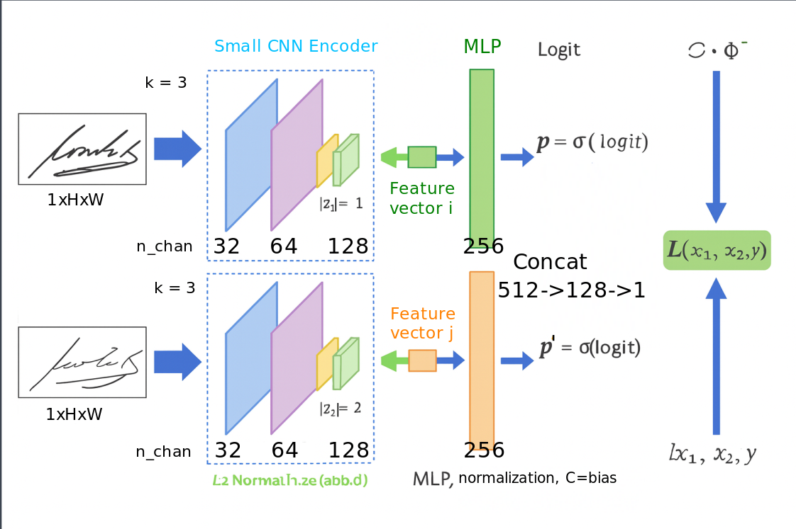
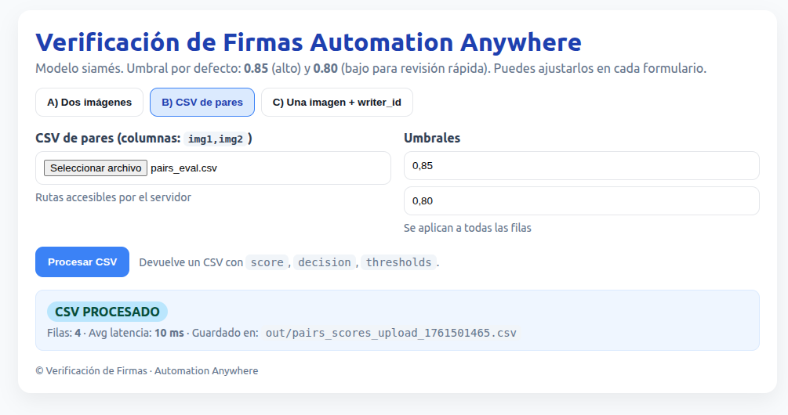
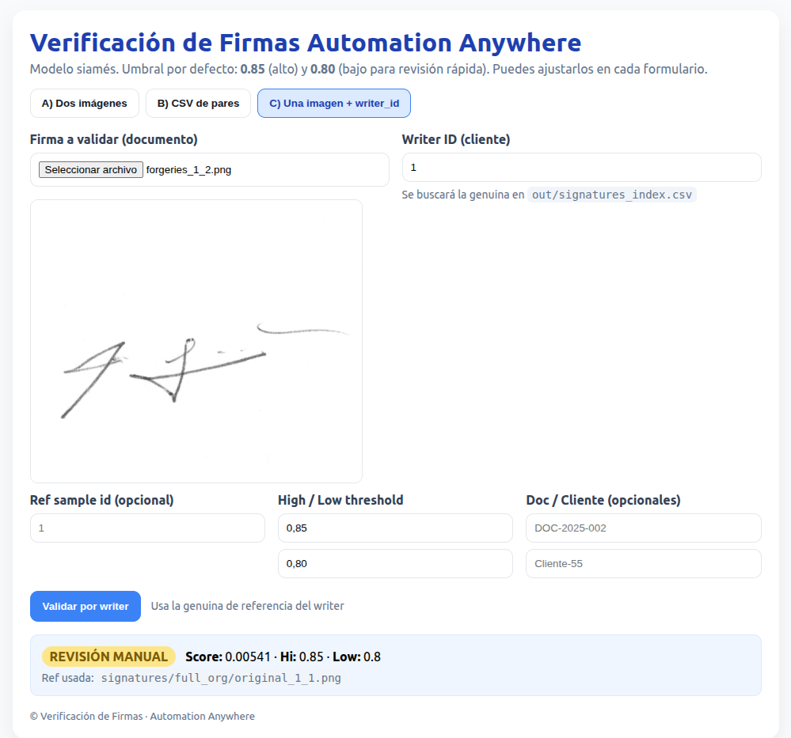

# Verificación de Firmas – Automation Anywhere Integration

Este proyecto implementa un **modelo convolucional siamés de verificación de firmas** en PyTorch con inferencia servida en **FastAPI**, permitiendo validar la autenticidad de documentos de forma automatizada y auditable.  
El sistema está preparado para su integración directa con el **Control Room de Automation Anywhere**, donde los bots gestionan la automatización del flujo completo — desde la recepción de firmas hasta la validación, registro y trazabilidad de métricas en tiempo real.

---

## Arquitectura del modelo

**Objetivo:** dado un par de firmas $\((x_1, x_2)\)$, predecir la probabilidad de que **pertenezcan al mismo firmante** (genuina vs. falsificación).

### 🔹 Componentes

1. **Encoder (SmallCNN)**  
   - Entrada: imagen en escala de grises $\(1\times H\times W\)$ (normalizada).  
   - 3 bloques Conv–BN–ReLU–MaxPool + `AdaptiveAvgPool2d(1)` → vector de tamaño 128.  
   - `fc` proyecta a un embedding de dimensión \(d\) (por defecto \(d=256\)).  
   - Se aplica **L2 normalization**:  
     $\[
     z = \frac{f(x)}{\|f(x)\|_2}
     \]$

2. **Cabezal Siamés (SiameseBin)**  
   - Para un par $\((z_1, z_2)\)$ se construye una representación simétrica:  
     $\[
     h = [\,|z_1 - z_2| \,;\, z_1 \odot z_2\,]
     \]$  
     (diferencia absoluta + producto elemento a elemento).  
   - MLP: `Linear(2d→128) + ReLU + Linear(128→1)` → **logit**.  
   - Probabilidad de “mismo firmante”:  
     $\[
     \hat{p} = \sigma(\text{logit})
     \]$

3. **Función de pérdida**  
   - Se entrena con **Binary Cross-Entropy with Logits** (BCE):  
     $\[
     \mathcal{L} = \text{BCEWithLogits}(\text{logit}, y),\quad y\in\{0,1\}
     \]$
     donde $\(y=1\)$ si ambas firmas pertenecen al mismo escritor y $\(y=0\)$ si no.  
   - Este enfoque es un **aprendizaje supervisado por pares (pairwise similarity)**, cercano al *metric learning*, pero **no utiliza** la *contrastive loss* ni *triplet loss* tradicionales.  
   - **Ventajas de BCE:**  
     - Convergencia rápida con datasets pequeños o medianos.  
     - Salida probabilística interpretable y fácil de calibrar.  
     - Permite definir **umbrales operativos** para decisión automatizada.

4. **Calibración y decisión**
   - En validación se obtienen las curvas **ROC** y **Precision–Recall**, se fija el umbral \(\tau\) que alcanza la **precisión objetivo (0.85)**.  
   - En producción se aplican dos umbrales:  
     - $\(\hat{p}\ge 0.85\)$ → `AUTO-VALIDADO`  
     - $\(0.80 \le \hat{p} < 0.85\)$ → `REVISIÓN RÁPIDA`  
     - $\(\hat{p}<0.80\)$ → `REVISIÓN MANUAL`

5. **Preprocesamiento**
   - Escala de grises, resize (224×224) y normalización con media/std del dataset.  
   - Aumentos leves: rotación ±3°, traslación y ruido ligero para robustez - Data Augmentation.
   - Generación de pares balanceados genuino–falso por `writer_id` (con seed fijo para reproducibilidad).



---

### 💡 Nota técnica

> Aunque el término *contrastive learning* se menciona como inspiración, este modelo entrena con **BCE sobre pares etiquetados**, no con la *contrastive loss* clásica.  
> En futuras versiones se puede migrar fácilmente a **Triplet Loss** o **Contrastive Loss** pura para un aprendizaje más métrico, eliminando el cabezal MLP y utilizando distancia coseno o euclídea directamente.


## Funcionalidades principales

- **Modelo Siamés entrenado en PyTorch**  
  Entrenado con *pairwise similarity* sobre pares genuino/falso, calibrado a una precisión objetivo de 0.85.

- **Interfaz Web en FastAPI + HTML/CSS puro**  
  Permite cargar imágenes o CSVs para validación instantánea.

- **Modos de uso:**
  1. **Dos imágenes:** comparar firma genuina y documento escaneado.  
     
  2. **CSV de pares:** ejecutar validación masiva en lote (ideal para QA o auditoría).  
     
  3. **Una imagen + Writer ID:** buscar la firma genuina registrada automáticamente y comparar contra el documento.  
     

- **Decisión inteligente basada en doble umbral:**  
  - ≥ **0.85** → `AUTO-VALIDADO`  
  - entre **0.80–0.85** → `REVISIÓN RÁPIDA`  
  - < **0.80** → `REVISIÓN MANUAL`

- **Registro de métricas en tiempo real (`ops_logs.csv`)**  
  Cada validación se traza con: `score`, `thresholds`, `writer_id`, `doc_id`, `latency_ms`, y versión del modelo.

---

## Integración con Automation Anywhere

La API FastAPI se integra con bots del **Control Room** para automatizar todo el flujo:

1. **Bot_Ingest:** recibe documentos o imágenes desde correo o carpeta compartida (capa Bronze -> capa Silver).  
2. **Bot_Verify:** llama a los endpoints `/score`, `/score_csv_upload` o `/score_writer`.  
3. **Bot_Reviewer:** revisa automáticamente los casos `revisión_rápida` o `manual`.  
4. **Bot_Export:** consolida métricas en un CSV compartido o dashboard Power BI (capa Silver -> capa Gold).

Esto garantiza **trazabilidad completa**, control de versiones de modelo y auditoría de decisiones (STP, revisiones, latencias y precisión real).

---

## Configuración rápida

```bash
# 1. Crear entorno virtual
python3 -m venv env
source env/bin/activate        # En Windows: env\Scripts\activate

# 2. Instalar dependencias
pip install --upgrade pip
pip install -r requirements.txt

# 3. Preprocesamiento inicial del dataset
python explore.py

# 4. Entrenamiento del modelo
# Entrenamiento simple
python train.py

# Cross-validation (k-folds)
python cv_train.py --folds 5

# 5. Iniciar el servidor FastAPI
uvicorn app:app --host 0.0.0.0 --port 8000 --reload

